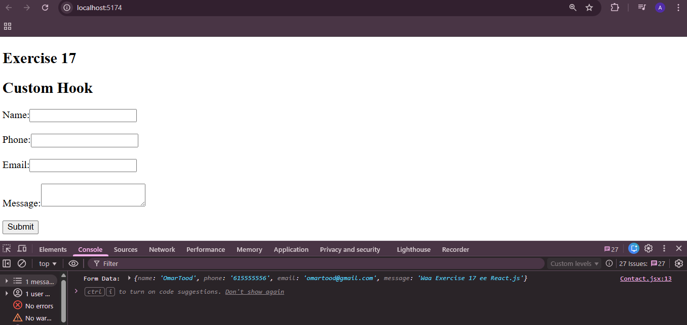

  ## React JS Exercise 17
  
  ***
  
  ## Developer Name: Eng Abdirahman Ai
  
  ***
  
  ## Group A
  
  ***
  
  [GitHub Link](https://github.com/engai2025/React-Exercise-17)
  
  ***
  
  ## Code
  
  ### App.jsx
  
  ```jsx
  import React from 'react'
 import useForm from './useForm'
 import Contact from './Contact'
 
 const App = () => {
   return (
     <div>
    <h2>Exercise 17</h2>
       <Contact />

     </div>
   )
 }
 
 export default App
 


  ```
  
  ### useForm.jsx
  
  ```jsx
  
 import { useState } from "react";

export default function useForm(initialState) {
  const [values, setValues] = useState(initialState);
 
  const handleChange = (e) => {
    const { name, value } = e.target;
    setValues({
      ...values,
      [name]: value,
    });
  };

 
  const resetForm = () => {
    setValues(initialState);
  };

  return {
    values,
    handleChange,
    resetForm,
  };
}


  ```
### Contact.jsx
  
  ```jsx
 import useForm from "./useForm";

export default function Contact() {
  const { values, handleChange, resetForm } = useForm({
    name: "",
    phone: "",
    email: "",
    message: "",
  });

  const handleSubmit = (e) => {
    e.preventDefault();
    console.log("Form Data:", values);
    resetForm();
  };

  return (
    <div>
      <h2>Custom Hook</h2>

      <form onSubmit={handleSubmit}>
        <label>Name:</label>
        <input
          type="text"
          name="name"
          value={values.name}
          onChange={handleChange}
        />

        <br />
        <br />

        <label>Phone:</label>
        <input
          type="text"
          name="phone"
          value={values.phone}
          onChange={handleChange}
        />

        <br />
        <br />

        <label>Email:</label>
        <input
          type="email"
          name="email"
          value={values.email}
          onChange={handleChange}
        />

        <br />
        <br />

        <label>Message:</label>
        <textarea
          name="message"
          value={values.message}
          onChange={handleChange}
        ></textarea>

        <br />
        <br />

        <button type="submit">Submit</button>
      </form>
    </div>
  );
}


```

 


 
## Output 
  
  ***
 
  
  
   
 
  ***


 


 
 
  
  ***
  
  ## Programming Language Used
  
  ***
  
  | Programming Language | Framework | Database |
  |:--------------------|:----------|:---------|
  | React JS            | 0         | 0        |
  
  ***
  
  ## Task
  
  - [x] Done
  
  